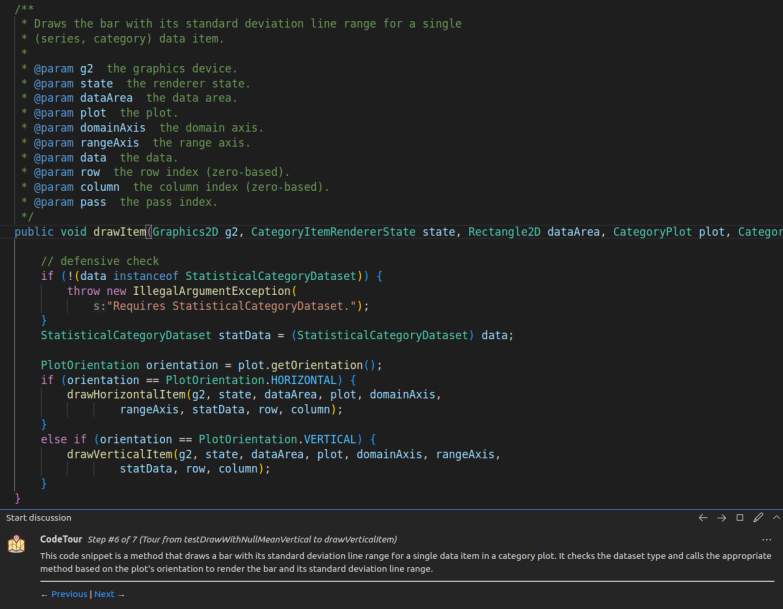

# nlbse24

## Prerequisites for Running This Project

Before running this project, ensure you have the following tools installed:
- `codeql`: https://docs.github.com/en/code-security/codeql-cli/getting-started-with-the-codeql-cli/setting-up-the-codeql-cli
- `defects4J`: https://github.com/rjust/defects4j
- `poetry`: You'll need Poetry to install the project dependencies. If you don't have it yet, check out [poetry](https://python-poetry.org/) to get it installed. The `poetry install` command installs dependencies and should be executed only once. The `poetry shell` command activates the virtual environment and should run at the start of each session.
- `Java 8`: We recommend using [sdk man](https://sdkman.io/install) because all you have to do is execute the command `sdk env install` after `poetry shell` to easily install the exact Java version we used (8.0.362-amzn).

Don't forget to create a `.env` file with these  variables:
```bash
DEFECTS4J_HOME= # path to Defects4J
CODEQL_HOME= # path to CodeQL
OPENAI_API_KEY= # OpenAI key
```

## Repository Structure Overview

### Model-View-Controller (MVC) Components

- [models](./models): Contains data models representing failing tests, projects, queries, etc.
- [controllers](./controllers):
    - [command_runner](./controllers/command_runner.py): Executes shell commands, manages file operations and directories, with comprehensive logging and error handling.
    - [d4j_controller](./controllers/d4j_controller.py): Facilitates interactions with the Defects4J database.
    - [db_controller](./controllers/db_controller.py): Manages operations related to CodeQL databases.

### Utility Modules

- [constants](./constants): Centralizes various constant values used across the project.
  - [code](./constants/code.py): Stores essential code snippets for project setup.
  - [paths](./constants/paths.py): Maintains frequently used paths.
  - [prompts](./constants/prompts.py): Prompts for explaining code snippets.
  - [queries](./constants/queries.py): CodeQL queries for method extraction.
- [ensure_in_path](./decorators/ensure_in_path.py): Ensures that `defects4J` and `codeql` are included in the system PATH.
- [pyproject.toml](./pyproject.toml): Configures project settings, dependencies, and build specifications.
- [install_codeql](./install_codeql.py): Install codeql libraries

### Scripts

- [generate_codetours.py](./generate_codetours.py): Creates code tours using the generated stack traces.
- [generate_stacktraces.py](./generate_stacktraces.py): Generates stack traces for each project versions.

### Data Resources

- [defects4j-bugs](./data/defects4j-bugs.json): Provides extracted information about Defects4J projects, sourced from Sobreira (2018).
- [dataset](https://github.com/balfroim/nlbse24-dataset): You'll find the generated data from all the scripts

## Walkthrough

We will use Chart 25 from falling test testDrawWithNullMeanVertical to the faulty method drawVeticalItem as an example for this walkthrough.

### 1. Initialisation

- Checking out the project's faulty (`b`) version using the [`defects4j checkout`](http://defects4j.org/html_doc/d4j/d4j-checkout.html) command.
- Preparing CodeQL
    - Copying the [folder](https://docs.github.com/en/code-security/codeql-cli/getting-started-with-the-codeql-cli/setting-up-the-codeql-cli) that contains the necessary tools and libraries for CodeQL database creation and analysis.
        - It contains the `method_extract.qll` file that helps extract methods or constructors' start and end lines from a Java class or interface.
            
            ```sql
            /**
            * @name Extract method boundaries
            * @description Extracts the start and end lines of methods or constructors from a Java class or interface.
            * @id java/extract-method-boundaries
            * @kind problem
            * @problem.severity warning
            */
            import java
            
            class MethodOrConstructor extends Callable {
              MethodOrConstructor() { this instanceof Method or this instanceof Constructor}
            
              string getFileName() { result = this.getLocation().getFile().getBaseName() }
            
              int getAnnotationsStartLine() {
                if exists(this.getAnAnnotation()) then
                  result = min(int line | line = this.getAnAnnotation().getLocation().getStartLine())
                else
                  result = this.getLocation().getStartLine()
              }
            
             
            
              int getJavadocStartLine() {
                if exists(this.getDoc().getJavadoc()) then
                  result = this.getDoc().getJavadoc().getLocation().getStartLine()
                else
                  result = this.getLocation().getStartLine()
              }
            
              int getMethodStartLine() {
                result = this.getBody().getLocation().getStartLine()
              }
            
              string toJson() {
                result = (
                  "{" + 
                    ""method_name": "" + this.getName() + "", " +
                    ""javadoc_start_line": " + this.getJavadocStartLine().toString() + ", " +
                    ""annotations_start_line": " + this.getAnnotationsStartLine().toString() + ", " +
                    ""method_start_line": " + this.getMethodStartLine().toString() + ", " +
                    ""end_line": " + this.getEndLine().toString() + 
                  "}"
                )
              }
            
              int getEndLine() { result = this.getBody().getLocation().getEndLine() }
            }
            
             
            
            predicate getMethodOrConstructor(MethodOrConstructor moc, string fileName, int callLine) {
              callLine in [moc.getMethodStartLine()..moc.getEndLine()] and
              moc.getFileName() = fileName
            }
            ```
            
    - Running the [`codeql database create`](https://docs.github.com/en/code-security/codeql-cli/codeql-cli-manual/database-create) command to create the CodeQL database.
        
        Note that the database creation time has been reduced by deleting passing tests. Automatic fixes are applied in some projects.
        

### 2. Recording stack traces

- Modifying the code source to record the stack trace
    - Copying a Java file with the `StacktraceRecorder` class
        
        ```java
        package org.jfree.chart.renderer.category;
        
        import java.io.BufferedWriter;
        import java.io.IOException;
        import java.io.PrintWriter;
        import java.util.regex.Matcher;
        import java.util.regex.Pattern;
        
        /**
         * Utility class to record a stack trace from a specified method to the end of
         * the stack trace.
         */
        public class StackTraceRecorder {{
        
            private String testName;
            private String fixedMethodName;
            private String path;
            private StackTraceElement[] stacktrace;
            private String encoding = "UTF-8";
        
            public StackTraceRecorder(String testName, String fixedMethodName, String path) {{
                this.testName = testName;
                this.fixedMethodName = fixedMethodName;
                this.path = path;
            }}
        
            public void recordStackTrace() {{
                stacktrace = Thread.currentThread().getStackTrace();
        
                if (isMethodInStackTrace(testName) && isMethodInStackTrace(fixedMethodName)) {{
                    writeStackTraceToFile();
                }}
            }}
        
            /**
             * Checks if a specified method name is present in the stack trace.
             *
             * @param methodName the name of the method to look for
             * @return true if the method name is found in the stack trace, false otherwise
             */
            private boolean isMethodInStackTrace(String methodName) {{
                for (int i = 0; i < stacktrace.length; i++) {{
                    StackTraceElement element = stacktrace[i];
                    if (methodName.equals(element.getMethodName())) {{
                        return true;
                    }}
                }}
            
                return false;
            }}
        
            /**
             * Writes the stack trace to a file starting from the specified method name.
             */
            private void writeStackTraceToFile() {{
                try {{
                    PrintWriter file = new PrintWriter(this.path, encoding);
                    BufferedWriter writer = new BufferedWriter(file);
                    writer.write("package,file,class,method,line number");
                    writer.newLine();
                    boolean startRecording = false;
        
                    for (int i = stacktrace.length - 1; i >= 0; i--) {{
                        StackTraceElement element = stacktrace[i];
                        
                        if (testName.equals(element.getMethodName())) {{
                            startRecording = true;
                        }}
                        if (startRecording) {{
                            String pattern = "(.*)\\\\.(.*)";
                            Pattern r = Pattern.compile(pattern);
                            Matcher m = r.matcher(element.getClassName());
                            if (!m.find()) {{
                                continue;
                            }} 
                            String packageName = m.group(1);
                            String className = m.group(2);
                            int lineNumber = element.getLineNumber();
                            StringBuffer buffer = new StringBuffer();
                            buffer.append(packageName);
                            buffer.append(',');
                            buffer.append(element.getFileName());
                            buffer.append(',');
                            buffer.append(className);
                            buffer.append(',');
                            buffer.append(element.getMethodName());
                            buffer.append(',');
                            buffer.append(lineNumber);
        
                            writer.write(buffer.toString());
                            writer.newLine();
                        }}
                        if (fixedMethodName.equals(element.getMethodName())) {{
                            break;
                        }}
                    }}
                    writer.flush();
                    writer.close();
                }} catch (IOException e) {{
                    System.err.println("Exception: " + e.getMessage());
                }}
            }}
        }}
        ```
        
    - Locating the faulty method to insert lines of code that will record the stack trace
        - Extracting data from [Sobreira et al.](http://program-repair.org/defects4j-dissection/#!/) available as a [JSON file](https://github.com/program-repair/defects4j-dissection/blob/master/defects4j-bugs.json)
            
            ```json
             "changedFiles": {
                  "org/jfree/chart/renderer/category/StatisticalBarRenderer.java": {
                    "changes": [
                      [
                        315
                      ],
                      [
                        459
                      ]
                    ],
                    "inserts": [
                      [
                        259,
                        260
                      ],
                      [
                        316
                      ],
                      [
                        344,
                        345
                      ],
                      [
                        403,
                        404
                      ],
                      [
                        460
                      ],
                      [
                        487,
                        488
                      ]
                    ]
                  }
                }
            ```
            
        - Generating the CodeQL query that will extract the start and end lines of the faulty  methods
            
            ```sql
            /**
            * @name Extract methods
            * @description Extracts the start and end lines of methods or constructors from a Java class or interface.
            * @id java/extract-methods
            * @kind problem
            * @problem.severity warning
            */
            import java
            import method_extract
            
            from MethodOrConstructor moc
            where 
            (
            	getMethodOrConstructor(moc, "StatisticalBarRenderer.java", 315) or
            	getMethodOrConstructor(moc, "StatisticalBarRenderer.java", 459) or
            	getMethodOrConstructor(moc, "StatisticalBarRenderer.java", 259) or
            	getMethodOrConstructor(moc, "StatisticalBarRenderer.java", 260) or
            	getMethodOrConstructor(moc, "StatisticalBarRenderer.java", 316) or
            	getMethodOrConstructor(moc, "StatisticalBarRenderer.java", 344) or
            	getMethodOrConstructor(moc, "StatisticalBarRenderer.java", 345) or
            	getMethodOrConstructor(moc, "StatisticalBarRenderer.java", 403) or
            	getMethodOrConstructor(moc, "StatisticalBarRenderer.java", 404) or
            	getMethodOrConstructor(moc, "StatisticalBarRenderer.java", 460) or
            	getMethodOrConstructor(moc, "StatisticalBarRenderer.java", 487) or
            	getMethodOrConstructor(moc, "StatisticalBarRenderer.java", 488)
            )
            select moc, moc.toJson()
            ```
            
        - Extracting the results of the query
            
            ```bash
            {"method_name": "drawVerticalItem", "javadoc_start_line": 360, "annotations_start_line": 373, "method_start_line": 381, "end_line": 500}
            ```
            
        - Now we can insert at line 381 (or 382 if there is a `super()`) two lines that records the stack trace
            
            ```java
            StackTraceRecorder recorder = new StackTraceRecorder("testDrawWithNullMeanVertical", "drawVerticalItem", "./results/stacktrace-testDrawWithNullMeanVertical-drawVerticalItem.csv");
            recorder.recordStackTrace();
            ```
            
- Running the tests with `defects4j test` to record the stack trace
    
    
    | package | file | class | method | line number |
    | --- | --- | --- | --- | --- |
    | org.jfree.chart.renderer.category.junit | StatisticalBarRendererTests.java | StatisticalBarRendererTests | testDrawWithNullMeanVertical | 200 |
    | org.jfree.chart | JFreeChart.java | JFreeChart | createBufferedImage | 1373 |
    | org.jfree.chart | JFreeChart.java | JFreeChart | createBufferedImage | 1393 |
    | org.jfree.chart | JFreeChart.java | JFreeChart | draw | 1219 |
    | org.jfree.chart.plot | CategoryPlot.java | CategoryPlot | draw | 2673 |
    | org.jfree.chart.plot | CategoryPlot.java | CategoryPlot | render | 2868 |
    | org.jfree.chart.renderer.category | StatisticalBarRenderer.java | StatisticalBarRenderer | drawItem | 212 |
    | org.jfree.chart.renderer.category | StatisticalBarRenderer.java | StatisticalBarRenderer | drawVerticalItem | 383 |

### 3. Extracting methods

- Generating the CodeQL query that will extract the start and end lines of the  methods in order
    
    ```sql
    /**
     * @name Extract methods ordered
     * @description Extracts the start and end lines of methods or constructors from a Java class or interface in order.
     * @id java/extract-methods-ordered
     * @kind problem
     * @problem.severity warning
     */
    import java
    import method_extract
    
    from MethodOrConstructor moc, int call_order
    where 
    (
    (getMethodOrConstructor(moc, "StatisticalBarRendererTests.java", 200) and call_order = 0) or
    	(getMethodOrConstructor(moc, "JFreeChart.java", 1373) and call_order = 1) or
    	(getMethodOrConstructor(moc, "JFreeChart.java", 1393) and call_order = 2) or
    	(getMethodOrConstructor(moc, "JFreeChart.java", 1219) and call_order = 3) or
    	(getMethodOrConstructor(moc, "CategoryPlot.java", 2673) and call_order = 4) or
    	(getMethodOrConstructor(moc, "CategoryPlot.java", 2868) and call_order = 5) or
    	(getMethodOrConstructor(moc, "StatisticalBarRenderer.java", 212) and call_order = 6) or
    	(getMethodOrConstructor(moc, "StatisticalBarRenderer.java", 383) and call_order = 7)
    )
    select moc, call_order.toString() + "|" + moc.toJson()
    ```
    
- Extracting the results of the query
    1. Method Name: `createBufferedImage`
        - Javadoc Start Line: 1361
        - Annotations Start Line: 1371
        - Method Start Line: 1372
        - End Line: 1375
    2. Method Name: `createBufferedImage`
        - Javadoc Start Line: 1377
        - Annotations Start Line: 1388
        - Method Start Line: 1390
        - End Line: 1396
    3. Method Name: `draw`
        - Javadoc Start Line: 1120
        - Annotations Start Line: 1132
        - Method Start Line: 1134
        - End Line: 1225
    4. Method Name: `draw`
        - Javadoc Start Line: 2536
        - Annotations Start Line: 2552
        - Method Start Line: 2555
        - End Line: 2722
    5. Method Name: `render`
        - Javadoc Start Line: 2835
        - Annotations Start Line: 2846
        - Method Start Line: 2847
        - End Line: 2904
    6. Method Name: `drawItem`
        - Javadoc Start Line: 173
        - Annotations Start Line: 188
        - Method Start Line: 197
        - End Line: 215
    7. Method Name: `drawHorizontalItem`
        - Javadoc Start Line: 217
        - Annotations Start Line: 230
        - Method Start Line: 238
        - End Line: 358

### 4. Selection

The "[select-codetours.py](http://select-codetours.py/)" script helps in selecting a subset of code tours based on the following criteria:

(i) The number of steps in a stack trace falls within the interquartile range of the number of steps observed in all stack traces from the same project.

(ii) At least half of the steps in the selected stack trace are not present in any other selected stack trace. This may result in a slightly different subset depending on the selection order. We follow an alphanumeric order based on project, version number, and tour name for selection.

(iii) Both the test and faulty methods in the selected code tour are unique.

### 5. Generation

- System prompt
    
    Since ChatGPT do not provide a system prompt, we followed the same approach as the Llama-2-chat paper and utilized their system prompt.
    
    > You are a helpful, respectful and honest assistant. Always answer as helpfully
    as possible, while being safe. Your answers should not include any harmful,
    unethical, racist, sexist, toxic, dangerous, or illegal content. Please ensure that
    your responses are socially unbiased and positive in nature.
    If a question does not make any sense, or is not factually coherent, explain why
    instead of answering something not correct. If you don’t know the answer to a
    question, please don’t share false information.
    > 
    
    However, we append information about the task 
    
    > Your goal is to assist a new programmer in onboarding a software project.
    > 
    
    And information about the failing test
    
    > The test has failed with the following error: junit.framework.AssertionFailedError, and it has produced the following message: .
    > 
- Direct task specification (zero-shot)
    
    > 
    > 
    > 
    > ```java
    >     /**
    >      * Creates and returns a buffered image into which the chart has been drawn.
    >      *
    >      * @param width  the width.
    >      * @param height  the height.
    >      * @param info  carries back chart state information (<code>null</code>
    >      *              permitted).
    >      *
    >      * @return A buffered image.
    >      */
    >     public BufferedImage createBufferedImage(int width, int height,
    >                                              ChartRenderingInfo info) {
    >         return createBufferedImage(width, height, BufferedImage.TYPE_INT_RGB,
    >                 info);
    >     }
    > 
    > ```
    > 
    > (Summarize and explain this code snippet in plain English:)
    > 
    - Task specification by demonstration (few-shot)
        
        We used the example from Figure 1 in Taylor, 2022. However, since we did not have the original code, we generated our version using ChatGPT based on the explanation. The generated code snippet may not be completely accurate or fully aligned with the description. However, this should be fine as ground truth demonstrations are not required [(Min, 2022)](https://aclanthology.org/2022.emnlp-main.759/).
        

        
        > 
        > 
        > 
        > ```java
        > public class PaintWindow {{
        >     private PaintObject paintObject;
        > 
        >     public PaintWindow() {{
        >         // Constructor initializes a default PaintObject for pencil drawing
        >         paintObject = new PaintObject(Color.GREEN, 5); // Green color, thickness 5
        >     }}
        > 
        >     public void onMouseEvent(MouseEvent e) {{
        >         // Method to handle mouse events like click, move, and release
        >         // Delegates the event handling to the PaintObject instance
        >         paintObject.handleEvent(e);
        >     }}
        > }}
        > 
        > public class PaintObject {{
        >     private Color color;
        >     private int thickness;
        > 
        >     public PaintObject(Color color, int thickness) {{
        >         // Constructor to initialize the PaintObject with specified color and thickness
        >         this.color = color;
        >         this.thickness = thickness;
        >     }}
        > 
        >     public void handleEvent(MouseEvent e) {{
        >         // Logic to handle mouse events and perform drawing on the canvas
        >         // Details are abstracted for this example
        >     }}
        > }}
        > 
        > ```
        > 
        > (Summarize and explain this code snippet in plain English:)
        > """
        > The PaintWindow contains an instance of a PaintObject. This class is responsible for responding to the mouse click, move, and release events the user performs on the application canvas.
        > In the lines of code above, the object constructor is initialised. By default, the object constructor is set to construct pencil objects on the canvas (i.e. free form strokes) in the color green, thickness 5. The last two lines above set the object constructor as a subscriber to any mouse or mouse motion events that take place on the canvas.
        > "”"
        >

Here is an excerpt of the sixth step of the code tour generated:



